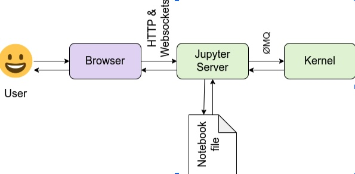
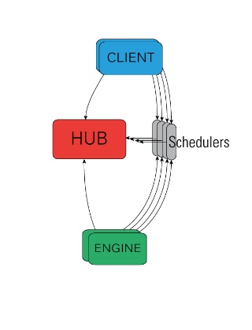
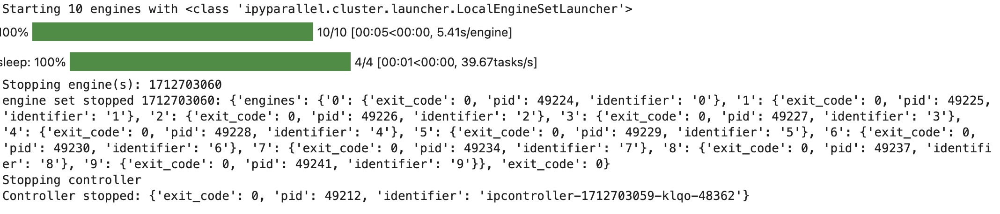

# dist_jupyter_parallel
Guide how to utilize parallel algorithms in Jupyter Notebook and optionally execute them in UTHPC

## Introduction to Jupyter Notebook, ipyparallel library, UT HPC, Slurm

### Introduction to Jupyter Notebook

Interactive development environment for notebooks(including text), code, data, visualization. Includes 3 main products:

Jupyter Notebook - classical notebook(formerly known as IPython notebook)
JupyterLAB - mostly single-user web UI where it is possible to open multiple notebooks
JupyterHUB - multi-user server with optional authentication

#### Jupyter Notebook classic

Jupyter notebook has 3 main components: ui, server and kernel

#### Jupiter LAB

#### Jupyter HUB

#### Binder

The Binder project offers an easy place to share computing environments to everyone. It allows users to specify custom environments and share them with a single link. Use cases involve workshops, scientific workflows and streamline sharing among teams.

https://jupyter.org/binder

#### nbgrader

nbgrader is a tool that facilitates creating and grading assignments in the Jupyter notebook. It allows instructors to easily create notebook-based assignments that include both coding exercises and written free-responses. nbgrader then also provides a streamlined interface for quickly grading completed assignments.

### Introduction to ipyparallel library

IPython library for parallel and distributed computing

Different styles of parallelization:

- Single program, multiple data (SPMD) parallelism
- Multiple program, multiple data (MPMD) parallelism
- Message passing using MPI
- Task farming
- Data parallel
- Combinations of these approaches
- Custom user-defined approaches

Use cases:
- Quickly parallelize algorithms interactively.
- Steer traditional MPI applications on a supercomputer from an IPython session on your laptop.
- Analyze and visualize large datasets.
- Develop, test and debug new parallel algorithms (that may use MPI) interactively.
- Tie together multiple MPI jobs running on different systems into one giant distributed and parallel system.
- Start a parallel job on your cluster and then have a remote collaborator connect to it and pull back data into their local IPython session for plotting and analysis.
- Run a set of tasks on a set of CPUs using dynamic load balancing

#### Magics

### Introduction to UT HPC Rocket

Rocket is a heterogeneous HPC cluster that currently consists of about 64 compute nodes, featuring almost 13000 cores, a bit over 50 terabytes of memory and 64 GPUs, interconnected by high-speed low-latency Infiniband networking. The cluster also utilizes two General Parallel File systems, which in sum total provide almost 10 petabytes of usable storage space.

Cluster uses SLURM job scheduling managing system.

### Introduction to SLURM

Slurm is an open source, fault-tolerant, and highly scalable cluster management and job scheduling system for large and small Linux clusters.

## Running cluster locally on default profile

It assumes that ipyparallel is installed locally. Cluster constructor starts controller and engines. If number of engines is not specified then it creates the same number of engines how many cores the machines has.

    import ipyparallel as ipp
    import time
    task_durations = [1] * 4
    # request a cluster
    with ipp.Cluster() as rc:
        # get a view on the cluster
        view = rc.load_balanced_view()
        # submit the tasks
        asyncresult = view.map_async(time.sleep, task_durations)
        # wait interactively for results
        asyncresult.wait_interactive()
        # retrieve actual results
        result = asyncresult.get()
    # at this point, the cluster processes have been shutdown

Execution:

Notebook file: [./ipyparallel_test_local.ipynb](./ipyparallel_test_local.ipynb)

## Running MPI IPython cluster locally

In order for MPI example to work locally, /etc/hosts file has to have entry for resolved hostname.

    import ipyparallel as ipp
    def mpi_example():
        from mpi4py import MPI
        comm = MPI.COMM_WORLD
        return f"Hello World from rank {comm.Get_rank()}. total ranks={comm.Get_size()}"
    
    # request an MPI cluster with 4 engines
    with ipp.Cluster(engines='mpi', n=4) as rc:
        # get a broadcast_view on the cluster which is best
        # suited for MPI style computation
        view = rc.broadcast_view()
        # run the mpi_example function on all engines in parallel
        r = view.apply_sync(mpi_example)
        # Retrieve and print the result from the engines
        print("\n".join(r))
    # at this point, the cluster processes have been shutdown

Notebook file: [./mpi_test_local.ipynb](./mpi_test_local.ipynb)

## Running IPython clusters on UT HPC Jupyter Notebook

[UT HPC Jupyter][1] is a service provided by [UT HPC][2].
It runs as a SLURM job inside [Rocket][3] cluster. Since runtime environment is your user home directory at UT it is easier to configure various aspects.

### Configure environment
I use conda package and environment management tool to configure python environment and install required python libraries. It is possible to register a python environment as a kernel for UT HPC Jupyter.
Log into rocket cluster

    ssh <username>@rocket.hpc.ut.ee

    module load any/python/3.8.3-conda
    conda create -n conda_venv_parallel
    conda activate conda_venv_parallel
    conda install ipykernel
    conda install ipyparallel
    python -m ipykernel install --user --name=conda_venv_parallel

Configure kernel:
see your configured environment variables:

    echo $PATH
    echo $LIBRARY_PATH
    echo $LD_LIBRARY_PATH

And insert the values to kernel JSON configuration file ~/.local/share/jupyter/kernels/conda_venv_parallel/kernel.json

Restart HPC Jupyter. Select `conda_venv_parallel` from kernel list in HPC Jupyter.

### Running default IPython cluster on UT HPC Jupyter 

### Running MPI IPython cluster on UT HPC Jupyter

In order for MPI commands to work, mpi4py library should be installed and imported. This example also uses magics that execute specified code in all engines

    import ipyparallel as ipp
    
    # it is important to specify number of tasks here(n), otherwise too much resources is requested from Rocket cluster
    # default engine_timeout is 60 seconds which is reached sometimes
    cluster = ipp.Cluster(engines="mpi",n=4, engine_timeout=120)
    client = cluster.start_and_connect_sync(activate=True)
    view = client[:]
    client.ids

It is visible from output that in case of MPI all tasks are executed locally on one node.

    %%px
    from mpi4py import MPI
    import platform
    mpi_rank=MPI.COMM_WORLD.Get_rank()
    mpi_size = MPI.COMM_WORLD.Get_size()
    print ("Process %d out of %d started in %s.\n" % (mpi_rank, mpi_size, platform.node()))

### Running SLURM cluster on UT HPC Jupyter using Rocket cluster

#### Configuration

Create new IPython profile for slurm specific configuration

    ipython profile create --parallel --profile=slurm

Add template for controller in HPC user home directory with filename slurm.controller.template

    #!/bin/sh
    #SBATCH --output={output_file}
    #SBATCH --export=ALL
    #SBATCH --job-name=ipcontroller-{cluster_id}
    #SBATCH --ntasks=1
    #SBATCH --time=30
    {program_and_args}

Add template for engines in HPC user home directory with name slurm.engine.template

    #!/bin/bash
    #SBATCH --time=30
    #SBATCH --export=ALL
    #SBATCH --output={output_file}
    #SBATCH --job-name=ipengine-{cluster_id}
    #SBATCH --ntasks={n}
    #SBATCH --nodes={n//5 + 1}
    srun {program_and_args} --debug --profile-dir={profile_dir} --cluster-id={cluster_id}

Configure ~/.ipython/profile_slurm/ipcluster_config.py:

    c.SlurmControllerLauncher.batch_template_file = 'slurm.controller.template'
    c.SlurmEngineSetLauncher.batch_template_file = 'slurm.engine.template'
    c.Cluster.controller_launcher_class = 'ipyparallel.cluster.launcher.SlurmControllerLauncher'
    c.Cluster.engine_launcher_class = 'ipyparallel.cluster.launcher.SlurmEngineSetLauncher'

#### Execution

    import ipyparallel as ipp
    from datetime import datetime as dt
    
    def hostname_example():
        import platform
        return f"Hello World from hostname {platform.node()}."
        
    cluster = ipp.Cluster(profile="slurm", n=12, timelimit="30", engine_timeout=80, log_level=10, delay=120)
    
    try:
        print(f"---starting cluster {dt.now()}")
        cluster.start_cluster_sync()
        
        print(f"---connecting client {dt.now()}")
        rc = cluster.connect_client_sync()
        print(f"---waiting for engines {dt.now()}")
        rc.wait_for_engines(n=12, timeout=1000)
    
        rc.ids
        print(f"---apply {dt.now()}")
        r = rc[:].apply_sync(hostname_example)
    
        print(f"---joining {dt.now()}")
        print("\n".join(r))
    finally:
        print(f"---closing {dt.now()}")
        # will also remove log files and connection files
        cluster.stop_cluster_sync()

Notebook file: [./slurm_example.ipynb](./slurm_example.ipynb)
## Running SLURM IPython cluster on Rocket cluster from local Jupyter Notebook

## Running MPI IPython cluster on Rocket cluster from local Jupyter Notebook

## References

[1]: https://docs.hpc.ut.ee/public/services/jupyter.hpc.ut.ee/ "UT HPC Jupyter"
[2]: https://hpc.ut.ee/ "UT HPC docs"
[3]: https://hpc.ut.ee/services/HPC-services/Rocket "UT HPC rocket"
[4]: https://docs.hpc.ut.ee/public/cluster/Software/python_envs "Python environments in HPC"
[5]: https://ipyparallel.readthedocs.io/en/latest/tutorial "IPyParallel tutorial"
[6]: https://ipyparallel.readthedocs.io/en/latest/api/ipyparallel.html "IPyParallel source"
